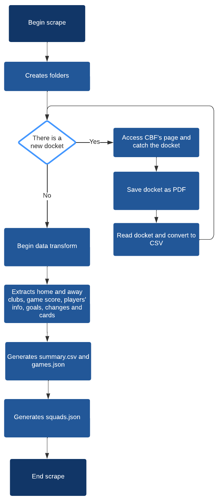

# Game Data Processing

This directory contains Python scripts for processing game data from various competitions.

## Files

- `functions.py`: Contains auxiliary functions for transforming extracted data.
- `scrape.py`: Contains functions used to extract game data from websites and save it as PDF and CSV files.
- `main.py`: Main code to run the data extraction process.

## Usage

To run the data extraction process, use the following command:

```shell
python main.py --s
```

- The --s argument indicates that the script will try to extract data from the CBF's page. If there are new documents, all the information will be processed. If you want to process all documents, even if there are no new ones, you can pass the --t argument along with the --s argument.
- If you want to clean the terminal output while running the script, you can pass the --c argument.

## Overview

An overview of all scraping process can be seen on image below
